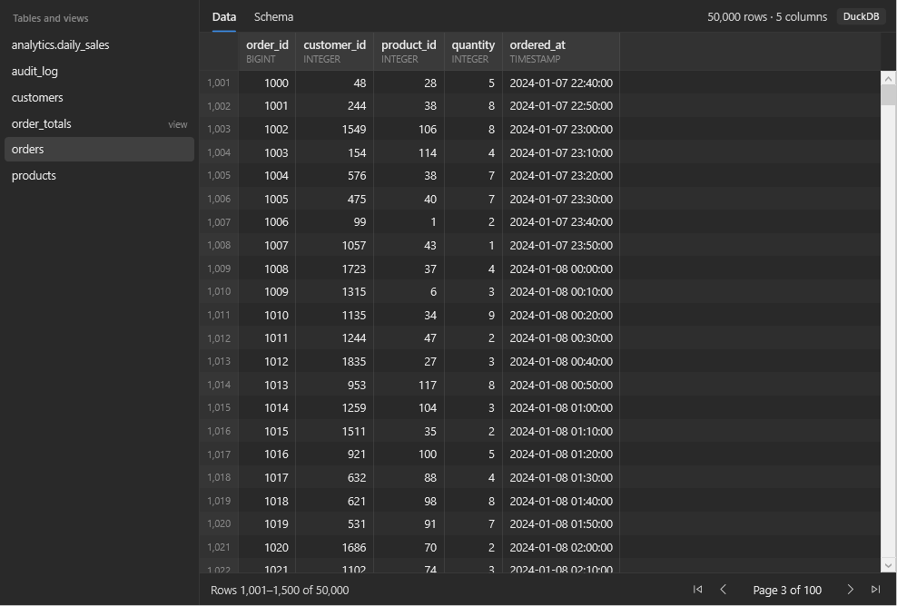
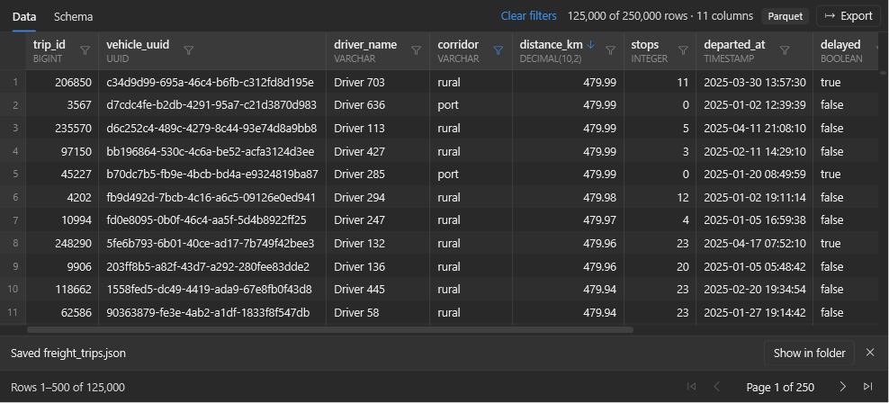

# QuickLook.Plugin.DuckDbViewer

A [QuickLook](https://github.com/QL-Win/QuickLook) plugin that previews data files with the
spacebar: **Parquet**, **DuckDB** and **SQLite**. It is powered by an embedded
[DuckDB](https://duckdb.org/) engine, so one code path serves every format.



## Features

- Tables and views listed in a sidebar; a Parquet file opens straight into its rows.
- Paged grid (500 rows per page) that stays responsive on files with millions of rows.
- Schema tab with column names, types and nullability.
- **Sort** by clicking a column header; the whole table is sorted, not just the visible page.
- **Filter** by value: the funnel in a column header lists the column's values with their
  row counts.
- **Export** the current view, with its filters and sort order, to CSV, Parquet or JSON.
- NULLs are shown distinctly, numbers are right-aligned, long values are truncated.
- Files are opened **read-only** and released as soon as the preview closes.
- Works **offline**: nothing is downloaded while previewing.
- Follows QuickLook's light and dark themes.

| Format | Extensions | Notes |
|---|---|---|
| Parquet | `.parquet`, `.parq` | |
| DuckDB | `.duckdb`, `.ddb`, `.db` | All schemas, tables and views |
| SQLite | `.sqlite`, `.sqlite3`, `.db3`, `.s3db`, `.sl3`, `.sqlitedb`, `.db` | Unencrypted databases |
| SQLite-based formats | `.gpkg` (GeoPackage), `.mbtiles` (MBTiles) | Shown as their underlying tables; geometry and tile columns appear as binary |

The extension only decides which files are inspected; the format itself is detected from
the file's contents, so a `.db` file is opened correctly whichever engine wrote it.



### Sorting, filtering and exporting

- Click a column header to sort ascending, again for descending, a third time to clear.
- The filter of a column offers its 1,000 most frequent values. Unticking values hides
  them; **Select none** followed by ticking values shows only those. Filters on several
  columns combine, and **Clear filters** removes them all.
- **Export** (in the panel, or in QuickLook's `⋯` menu) writes a new file next to the
  original, for example `trips.parquet` to `trips.csv`, or `shop.duckdb` to
  `shop_orders.csv`. Existing files are never overwritten; if the folder is read-only the
  file goes to your Downloads folder. There is no save dialog because QuickLook treats
  <kbd>Enter</kbd> and <kbd>Space</kbd> as "open" and "close preview" while any of its
  windows has the focus, so confirming a file name would close the preview.

## Install

1. Download the latest `.qlplugin` file from the [releases page](https://github.com/AhmedAredah/QuickLook.Plugin.DuckDbViewer/releases).
2. Select it in File Explorer and press <kbd>Space</kbd>.
3. Click **Install**, then restart QuickLook.

Two packages are published:

| Package | Size | SQLite support |
|---|---|---|
| `QuickLook.Plugin.DuckDbViewer-x.y.z.qlplugin` | larger | Built in |
| `QuickLook.Plugin.DuckDbViewer-x.y.z-lite.qlplugin` | smaller | Downloads DuckDB's SQLite extension once, on first use |

Requirements: QuickLook 4.5 or later on 64-bit Windows with .NET Framework 4.7.2 or later
(included in Windows 10 1803 and newer).

## Limitations

- The embedded engine is **DuckDB 1.4.4**, the last version usable from a .NET Framework
  host. Database files written by a newer DuckDB with a newer storage format may not open;
  the preview then shows DuckDB's error message.
- Encrypted SQLite databases are not supported.
- Values are displayed as text exactly as DuckDB renders them, and filters match that text
  (its first 200 characters). There is no free-text search and no SQL input: both would
  need the <kbd>Space</kbd> key, which QuickLook reserves for closing the preview.
- SQLite values are read as text because SQLite does not enforce column types. Numeric
  columns still sort numerically, but a SQLite table exported to Parquet has text columns.
- A DuckDB file that another process has open for writing cannot be read at the same time.

## Building

Requires the [.NET SDK](https://dotnet.microsoft.com/download) 9.0 on Windows.

```powershell
dotnet test                    # build everything and run the tests
./scripts/pack.ps1             # create artifacts\*.qlplugin
./scripts/install-dev.ps1      # build, install into the local QuickLook and restart it
```

The first build downloads the SQLite extension for the pinned DuckDB version into
`artifacts\extensions\` (see `scripts/fetch-extensions.ps1`).

### Working on the UI without QuickLook

`tools/DuckDbViewer.DevHost` hosts the preview panel in a plain window:

```powershell
dotnet run --project tools/DuckDbViewer.DevHost -- C:\data\sample.duckdb --theme light
```

Add `--screenshot out.png` to render the panel off-screen to an image and exit. `--select
<object>`, `--tab schema`, `--filter <column>=<a>|<b>`, `--sort <column>[:desc]`,
`--page <n>`, `--export csv|parquet|json`, `--popup filter:<column>|export` and
`--size <w>x<h>` choose what is done and rendered.

## Project layout

```
src/QuickLook.Plugin.DuckDbViewer/
  Plugin.cs          QuickLook entry point (IViewer); the only public type, no logic
  Detection/         Which files the plugin accepts, decided by magic bytes
  Data/              DuckDB session, row queries (filter, sort, page, export), SQL escaping
  Formats/           One class per file format
  ViewModels/        Preview state, background loading, cancellation, paging, filter editor
  Views/             XAML panel and styles
  Localization/      Translations.config lookup
  Native/            Loading the native engine and private dependencies in the host
tests/               xUnit tests for everything below the XAML
tools/               Development host
scripts/             Packaging, local install, extension download
```

`Detection`, `Data` and `Formats` have no UI dependencies. The view layer talks to them
only through `Data/PreviewDocument`.

### Adding a format

1. Add a value to `Detection/FileFormat` and teach `FormatDetector` its extensions and
   magic bytes.
2. Add a `Formats/FormatHandler` subclass that makes the file readable in DuckDB and
   returns its `DataObject`s. Derive from `AttachedDatabaseFormat` if DuckDB can `ATTACH`
   the format, otherwise return a table function call as `ParquetFormat` does.
3. Register it in `FormatHandler.For` and add a sample to `tests/SampleFiles.cs`.

Schema, row counts, paging, sorting, filtering, export and the whole UI then work without further changes.

### Upgrading DuckDB

The DuckDB version is set once, as `DuckDbVersion` in `Directory.Build.props`. It selects
the DuckDB.NET package, the native engine and the matching extension download. Versions
after 1.4.4 require DuckDB.NET to target `netstandard2.0` again, or QuickLook to move off
.NET Framework.

## Licence

[GPL-3.0](LICENSE), the same licence as QuickLook. Bundled third-party components are
listed in [THIRD-PARTY-NOTICES.md](THIRD-PARTY-NOTICES.md).
